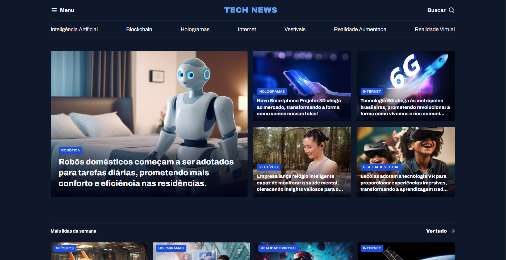

<h1 align="center"> Tech News | Portal de Notícias </h1>

  <a href="#-projeto">O Projeto</a>&nbsp;&nbsp;&nbsp;|&nbsp;&nbsp;&nbsp;
  <a href="#-tecnologias">Tecnologias</a>&nbsp;&nbsp;&nbsp;|&nbsp;&nbsp;&nbsp;
  <a href="#-layout">Layout</a>&nbsp;&nbsp;&nbsp;|&nbsp;&nbsp;&nbsp;
  <a href="#-licença">Licença</a>

  
  

## 💻 O Projeto

O **Tech News** é a interface de um portal de notícias com foco em tecnologia (IA, Realidade Virtual, Hologramas, etc). O objetivo principal foi praticar a estruturação visual avançada e a componentização do CSS a partir de um design de referência.

Os principais destaques do desenvolvimento incluem:

1. **Arquitetura CSS Modular:** Em vez de um único arquivo gigante misturando tudo, o CSS foi dividido de forma inteligente (`global.css`, `utility.css`, `header.css`, `sections.css`) e importado no arquivo principal (`index.css`), simulando a arquitetura de aplicações da vida real.
2. **Classes Utilitárias (Utility-First):** Criação de pequenas classes padronizadas e reutilizáveis (como `.grid`, `.gap-16`, `.text-2xl`), acelerando a estilização do HTML.
3. **Controle de Imagens:** Aplicação da propriedade `object-fit: cover` e recortes (`overflow: hidden`) em *cards* para garantir que todas as imagens mantenham um padrão visual harmonioso, sem amassar ou esticar a imagem original.

## 🚀 Tecnologias

Este projeto foi construído utilizando as seguintes ferramentas e conceitos modernos:

* **HTML5 Semântico:** Uso estratégico de tags como `<article>`, `<figure>`, `<figcaption>`, `<aside>` e `<section>` para melhorar o SEO e a clareza do código.
* **CSS3 Avançado:**
    * **CSS Grid & Áreas de Grid:** Posicionamento complexo de elementos utilizando `grid-template-areas` para organizar as notícias na tela de forma limpa.
    * **CSS Nesting:** Aninhamento nativo de seletores (colocar um seletor dentro do outro), mantendo os arquivos mais curtos e organizados.
    * **Pseudo-classes e Pseudo-elementos:** Uso do seletor relacional `:has()` para aplicar estilos dependendo do que tem dentro da caixa, e pseudo-elementos como `::before` para criar gradientes escuros sobre as imagens de destaque.
    * **Propriedades Lógicas:** Utilização de `margin-block`, `padding-inline`, adaptando o layout aos eixos da tela.
    * **Variáveis CSS (`:root`):** Padronização de cores, tipografia e espaçamentos.
* **Git & GitHub:** Versionamento e deploy da aplicação.
* **Figma**

## 🔖 Layout

Você pode visualizar e interagir com o projeto através dos links abaixo:

* 📲 **[Acesse o layout original do projeto no Figma aqui](https://www.figma.com/community/file/1362166020452569562)**
* 👉 **[Acesse o site Tech News funcionando aqui](https://alissonfa.github.io/portal-de-noticias/)**

**Para rodar no seu computador (Local):**

1. Faça o download ou clone o repositório.
2. Certifique-se de que a estrutura de pastas está correta.
3. Dê um duplo clique no arquivo `index.html` ou abra através da extensão *Live Server* no seu editor de código.

## 📝 Licença

Esse projeto está sob a licença MIT.

---

Feito com 💜 por **[AlissonFA](https://www.linkedin.com/in/alissonfa/)**